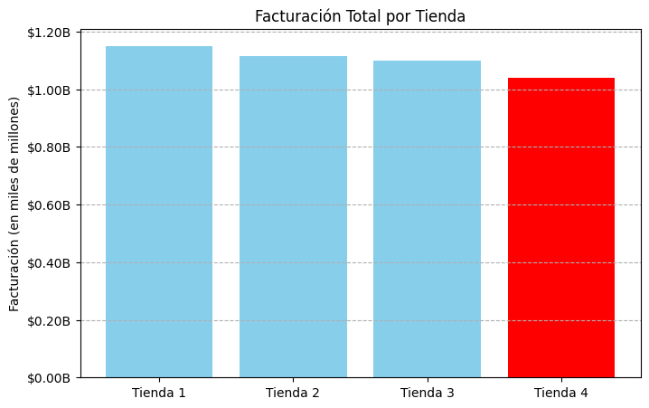
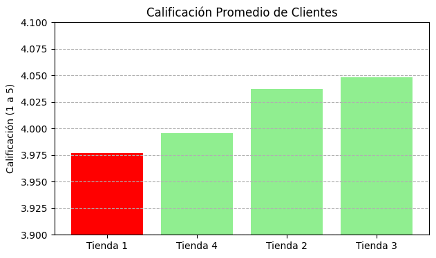
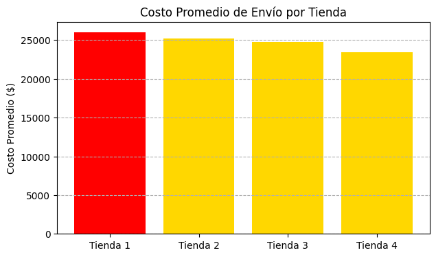

# 🚀 Desafío Alura Store: Análisis de Rendimiento y Decisión Estratégica

---

## 🎯 El Problema de Negocio

El objetivo fue identificar la tienda con el **menor rendimiento** para recomendar su venta. El análisis se basó en el criterio fundamental de **Facturación Total**.

---

## 🧠 Metodología Técnica y Stack

El proyecto demuestra un dominio completo del flujo de *Data Science* con Python:

* **Manipulación de Datos (Pandas):** Consolidación de datos (`pd.concat`), segmentación (`groupby`) y funciones de agregación (`sum`, `mean`).
* **Visualización (Matplotlib):** Construcción de gráficos de barras para comunicar los *insights* clave.
* **Estructuras Condicionales:** Uso avanzado de `transform()` y *Boolean Indexing* para filtrado dinámico.

---

## 📊 Resultados y Decisión Ejecutiva

### 1. Indicadores de Rendimiento y Riesgo

La Tienda 4 es el riesgo de **volumen**, mientras que la Tienda 1 es el riesgo de **margen** y **servicio**.

| Métrica | Tienda con **PEOR** Rendimiento | Valor Clave | Consecuencia de Negocio |
| :--- | :--- | :--- | :--- |
| **Facturación Total** | **Tienda 4** | **$1,038.4 M** | Menor volumen de negocio. |
| **Costo Operacional (Envío)** | **Tienda 1** | **$26,018.61** | La operación logística más costosa. |
| **Satisfacción (Calificación)** | **Tienda 1** | 3.98 / 5.0 | Riesgo de retención de clientes. |

### 2. Conclusión Gráfica (Justificación de la Venta)

La visualización de la facturación justifica la venta del activo menos productivo:

#### 📉 Facturación Total por Tienda

### 💡 Decisión Final

> **Recomendación:** Se debe vender la **Tienda 4**.
>
> La decisión es puramente estratégica: vender el activo con la **Facturación Total más baja** es la forma más limpia de liberar capital. El capital se debe invertir en la Tienda 1 para corregir sus ineficiencias logísticas y de servicio.

---

## 🖼️ Análisis de Eficiencia Operativa (Tienda 1)

Los problemas operativos de la Tienda 1 son evidentes al analizar la calidad y los costos:

| Calificación Promedio | Costo Promedio de Envío |
| :--- | :--- |
|  |  |

---

## 💻 Instrucciones de Ejecución

Para replicar el análisis completo:

1.  Abre el *notebook* **`AluraStoreLatam.ipynb`** en Google Colaboratory.
2.  Ejecuta todas las celdas de código secuencialmente.